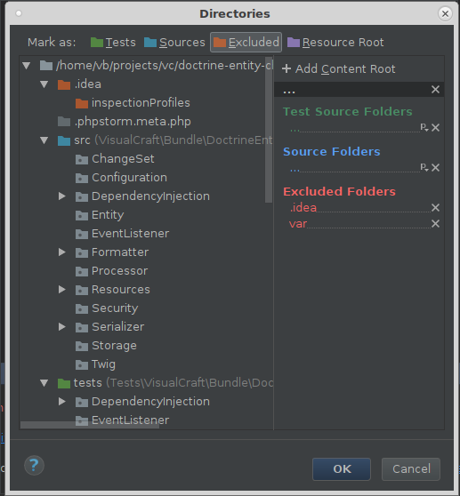
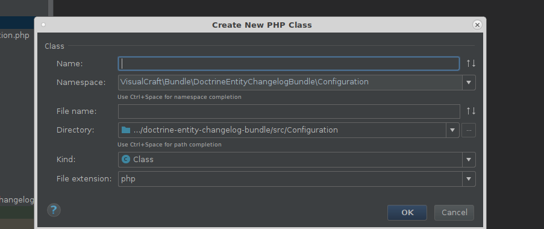
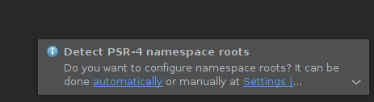

# PHPSTORM
## Налаштування перед початком роботи
### Встановити додаткові плагіни
- .ignore 
(Покращує роботу з .ignore  файлом git і іншими системами контролю версій.
Додає в меню new можливість створити .ignore файл.
Додає автокомпліт і інспекшени.
Додає відображення глобального .gitignore)
- BashSupport (додає підтримку Bash)
- 3v4l pl4g1n (інтеграція з [3v4l.org](http://3v4l.org). Дозволяє виділенй код чи весь файл відправити на виконання на цей сайт.)
- String Manipulation (додає можливості перетворення тексту (camelCase, hyphen-lowercase, HYPHEN-UPPERCASE, snake_case, SCREAMING_SNAKE_CASE, dot.case, words lowercase, Words Capitalized, PascalCase))
- PHP RegExp Support (підсвітка синтаксису RegExp)
- PHP Toolbox (використовую для автокомпліта в callable arrays)
- Adders/Removers Generator (Адлери і ремувери аналогічно як гетери і сетери).
- PHP Class Templates (Для додавання своїх темплейтів для php classes і для темплейта Exceptions)
- PHP composer.json support (інспкшени composer.json, відображення версій і автокомпліт)
- PHP PSR-4 Namespace Detector (при першому заванаженні проекта додає детек psr-4 в composer.json і авто настройку в `File > Settings > Directories`)
- PHP Inspections (EA Extended) (По бажанню. Розширює інспекшини для php. Про можливості даного плагіна нижче.)
- PHPUnit Enhancement  (для автокомпліту при використанні бібліотеки sebastianbergmann/phpunit-mock-objects або phpspec/prophecy)
- PHP Annotation # Specific for Symfony (Додає підтримку Doctrine Annotation)
- Symfony Plugin # Specific for Symfony

### CODE STYLE
- для нових файлів налаштувати переноси (для Windows) на юніксові

    `Settings > Editor > Code Style > Line separator (for new files)`
- налаштування авто додавання при зберіганні файлу пустої лінії в кінці файла

    `Settings > Editor > General > Ensure line feed at end file on save`
- налаштування відопраження пробілів

    `File > Settings > Editor > General > Appearance > Show whitespaces`

- В PhpStorm 2017.1 додали name hints. Для вимкнення:

 В меню `File > Settings > Editor > General > Appearance` зняти галочку з Show parameter name hints.

- налаштування кількості пробілів при натисканні таб в YML файлі:

    `File > Settings > Editor > Code Style > YAML > Indent` змінюємо на 4
- змінюємо налаштування кількості пробілів між різними рівнями вложеності

    `File > Settings > Editor > Code Style > JSON > Indent` на 4
- змінюємо відображення табів замість однієї лінії в декілька.

   Знімаємло галочку `File > Settings > Editor > General > Editor Tabs > Show tabs in single row`
- По дефолту максимум 10 відкритих табів.

    Для зміни вписуємо бажане значення параметру в інпут який знаходиться в
    `File > Settings > Editor > General > Editor Tabs > Tab Closing Policy > Tab limit`
- Налаштування код стайлку для PHP. 
    Налаштування знаходяться

    `Settings > Editor > Code Style > PHP`

    Для налаштування виконати наступні дії:
    Замінити папку `%configFolder%/codestyles/` папкою з `config/codestyles`.
    (Де знаходиться папка `%configFolder%` у вашій системі можна дізнатися по лінкові
     [Project and IDE settings](https://www.jetbrains.com/help/phpstorm/2017.1/project-and-ide-settings.html)).
     Або виконати наступні дії
    - у вікні клікнути `Set from... > Predefined Style > Symfony2` для налаштування Symfony CS.
    - прочекати `Spaces > Around Operators > Concatenation (.)`
    - прочекати `Other > Array declaration style > Force short declaration style`
    - Значення налаштування `File > Settings > Editor > Code Style > PHP > Blank Lines > Around Fields` змінюємо на 1
    - Значення налаштування `File > Settings > Editor > Code Style > PHP > Blank Lines > Keep Maximum Blank Lines > In declarations` на 0
    - Значення налаштування `File > Settings > Editor > Code Style > PHP > Blank Lines > Keep Maximum Blank Lines > In code` на 1
    - Значення налаштування `File > Settings > Editor > Code Style > PHP > Blank Lines > Keep Maximum Blank Lines > Before '}'` на 0

### Налаштування File and Code Templates

Замінити папку `%configFolder%/fileTemplates/` папкою з `config/fileTemplates`.
Або змінити в `Settings > Editor > File And Code Templates > Code` наступне:


- PHP Constructor change to

    ```php
    /**
    ${PARAM_DOC}
    */
    public function __construct(${PARAM_LIST}) 
    {
    ${BODY}
    }
    ```
  
- PHP Setter Methods

    ```php
    /**
    * @param ${TYPE_HINT} $value
    #if (${STATIC} != "static")
    * @return $this
    #end
    */
    public ${STATIC} function set${NAME}($value)
    {
    #if (${STATIC} == "static")
      self::$${FIELD_NAME} = $value;
    #else
      $this->${FIELD_NAME} = $value;
    
      return $this;
    #end
    }
    ```
    
- PHP Getter Method
    
    ```php
    /**
    * @return ${TYPE_HINT}
    */
    public ${STATIC} function get${NAME}()
    {
    #if (${STATIC} == "static")
      return self::$${FIELD_NAME};
    #else
      return $this->${FIELD_NAME};
    #end
    }
    ```

Змінити в `Settings > Editor > file And Code Templates > Files` наступне:
- PHP File

    ```php
    <?php
    ```
    
- PHP Trait

    ```php
    <?php
    
    #if (${NAMESPACE})
    namespace ${NAMESPACE};
    #end
    
    trait ${NAME}
    {
    
    }
    ```

- PHP Class

    ```php
    <?php

    #if (${NAMESPACE})
    namespace ${NAMESPACE};
    #end

    class ${NAME}
    {

    }
    ```
- PHP Interface

    ```php
    <?php

    #if (${NAMESPACE})
    namespace ${NAMESPACE};
    #end

    interface ${NAME}
    {

    }
    ```
- PHPUnit Test

    ```php
    <?php

    #if (${NAMESPACE})
    namespace ${NAMESPACE};
    #end

    #if (${TESTED_NAME} && ${NAMESPACE} && !${TESTED_NAMESPACE})
    use ${TESTED_NAME};
    #elseif (${TESTED_NAME} && ${TESTED_NAMESPACE} && ${NAMESPACE} != ${TESTED_NAMESPACE})
    use ${TESTED_NAMESPACE}\\${TESTED_NAME};
    #end

    class ${NAME} extends#if(${NAMESPACE}) \PHPUnit_Framework_TestCase #else PHPUnit_Framework_TestCase #end{

    }
    ```
- PHPUnit 6 Test

    ```php
    <?php

    #if (${NAMESPACE})
    namespace ${NAMESPACE};
    #end

    #if (${TESTED_NAME} && ${NAMESPACE} && !${TESTED_NAMESPACE})
    use ${TESTED_NAME};
    #elseif (${TESTED_NAME} && ${TESTED_NAMESPACE} && ${NAMESPACE} != ${TESTED_NAMESPACE})
    use ${TESTED_NAMESPACE}\\${TESTED_NAME};
    #end
    use PHPUnit\Framework\TestCase;

    class ${NAME} extends TestCase {

    }
    ```
- Якщо встановлений плагін PHP Class Templates змінити також темплейт для Exceptions

    ```php
    <?php

    #if (${NAMESPACE})
    namespace ${NAMESPACE};
    use ${EXCEPTION};
    #end

    class ${NAME} extends ${EXCEPTION} {
    #if (${EXCEPTION_MESSAGE})
        public function __construct() {
            parent::__construct('${EXCEPTION_MESSAGE}');
        }
    #end
    }
    ```

Якщо встановлений плагін Adders/Removers Generator змінюємо  також темплейти:

- Adder

    ```php
    /**
     * @param ${TYPE_HINT} $value
     * @return $this
     */
    public function ${METHOD_NAME}($value)
    {
    #if (${IS_DOCTRINE_COLLECTION} == "doctrine")
        $this->${FIELD_NAME}[] = $value;
        // uncomment if you want to update other side
        //$value->set${THIS_CLASS_NAME}($this);
    #else
        $this->${FIELD_NAME}[] = $value;
    #end
        return $this;
    }
    ```
-  Remover

    ```php
    /**
     * @param ${TYPE_HINT} $value
     * @return $this
     */
    public function ${METHOD_NAME}($value)
    {
    #if (${IS_DOCTRINE_COLLECTION} == "doctrine")
        $this->${FIELD_NAME}->removeElement($value);
        // uncomment if you want to update other side
        //${PARAM_NAME}->set${THIS_CLASS_NAME}(null);
    #else
        if ($key = array_search($value, $this->${FIELD_NAME}, true) !== false) {
            array_splice($this->${FIELD_NAME}, $key, 1);
        }
    #end
        return $this;
    }
    ```

### Налаштування інспекшенів
Замінити папку `%configFolder%/inspection/` папкою з `config/inspection`. Або налаштувати вручну.
Налаштування знаходяться в `File > Settings > Editor > Inspections` змінюємо наступні інспекшени:
- чекаємо
    - `General > Inconsistent line separators`
    - `General > TODO comment` (змінити левел на `Weak Warning`)
    - `General > Problematic whitespace`
    - `PHP > Code Smell > Case mismatch in method call or class usage`
    - `PHP > Code Style > Traditional syntax array literal detected`
    - `PHP > Code Style > Class path doesn't match project structure`
    - `PHP > Code Style > Multiple classes declarations in one file`
    - `PHP > Code Style > Short syntax can be used in array literals.`
    - `PHP > Code Style > Redundant closing tag` (Змінюємо левел на `Warning`)
    - `PHP > PHPDoc > Missing PHPDoc comment.` Анчекаємо в настройці цього інспекшена чекбокси біля `Class` i `Const`.
    - `PHP > Code Style > Unnecessary fully qualified name`
- анчекаємо
    - `PHP > Php Inspections (EA Extended) > Architecture > Long inheritance chain`
    - `PHP > Php Inspections (EA Extended) > Control Flow > Exceptions handling and annotating`
    - `PHP > Php Inspections (EA Extended) > Architecture > Too many parameters in a callable`
- в PhpStorm 2016.3 зявився для php нова група інспекшинів - `Naming conventions`.
     чекаємо `PHP > Naming conventions` і змінюємо `Severity` на `Week warning`

    - `PHP > Naming conventions > Class name is not following coding convention`
        - змінюємо `Min length: 2`
        - змінюємо `Max length: 100`

    - `PHP > Naming conventions > Constant name is not following coding convention`
        - змінюємо `Min length: 2`
        - змінюємо `Max length: 100`

    - `PHP > Naming conventions > Function name is not following coding convention`
        - змінюємо `pattern: [a-z][A-Za-z\d]*`
        - змінюємо `Min length: 2`
        - змінюємо `Max length: 100`

    - `PHP > Naming conventions > Method name is not following coding convention`
        - змінюємо `Min length: 2`
        - змінюємо `Max length: 100`

    - `PHP > Naming conventions > Property name is not following coding convention`
        - змінюємо `Min length: 1`
        - змінюємо `Max length: 100`

    - `PHP > Naming conventions > Variable name is not following coding convention`
        - змінюємо `pattern: [a-z][A-Za-z\d]*`
        - змінюємо `Min length: 1`
        - змінюємо `Max length: 100`

### Налаштування Live templates
Додаємо knp live template [GitHub](https://github.com/knpuniversity/phpstorm-settings).
Додаємо з папки `config/templates` темплейт для `inheritdoc`.
Як додати власні live template  розповідається в [KnpUniversity](https://knpuniversity.com/screencast/phpstorm/live-templates)

## Налаштування перед початком роботи над проектом
Cконфігурувати Directories. `File > Settings > Directories`


Для всіх проектів познати як excluded .idea (це дозволить не індексувати ці папки)
Для Symfony проетів потрібно кеш, логи познати як excluded.
А src як source (це дозволить генерувати класи з неймспейсом )
Якщо в проекті юзається composer i Psr-4 і якщо встановити плагін "PHP PSR-4 Namespace Detector" він додає авто детект для psr-4.
При першому запуску проекту (коли в папці .idea немає файла з рошриренням .iml і іменем з імям проекта) зявиться нотіфікейшин з пророзицією авто конфіга


Для визова повторно вручну клікаємо `Code > Detect PSR-4 Namespace Roots`. Потім в попапі доконфігуровуємо (проставляємо `Excluded`).
Цей плагін постарається вгадати де `Sourсes` а де `Tests` і проставити правельні префікси для namespaces.
Якщо в проекті використовується PSR-0 то для нього подібна підтримка є по дефолту.

### Symfony  plugin
Основні можливості можна побачити по лінку
[phpstor screencast](https://knpuniversity.com/screencast/phpstorm)

# PHP-CS-Fixer
Ця тулза для виправлення cs [GitHub](https://github.com/FriendsOfPHP/PHP-CS-Fixer).
Як Використовувати разом з PhpStorm по [лінкові](https://gist.github.com/mpalourdio/46f792347cf9d46b121c).
Інформація [як додати запуск по комбінації клавіш](http://tzfrs.de/2015/01/automatically-format-code-to-match-psr-standards-with-phpstorm/).
Додати в кореневу директорію з проектом файл .php_cs з наступною конфігурацією.
Або встановити в папку ~/bin з іменем php-cs-fixer і скопіювати в папку `%configFolder%/` папки `config/tools`, `options/keymap.xml` i `keymaps/`.
Комбінація на яку всановлено запуск `alt + p`.

```php
<?php

return PhpCsFixer\Config::create()
    ->setRiskyAllowed(true)
    ->setUsingCache(false)
    ->setRules([
        '@Symfony' => true,
        '@Symfony:risky' => true,
        '@PHP56Migration' => true,
        'combine_consecutive_unsets' => true,
        'array_syntax' => ['syntax' => 'short'],
        'no_useless_else' => true,
        'no_useless_return' => true,
        'ordered_class_elements' => true,
        'ordered_imports' => true,
        'concat_space' => ['spacing' => 'one'],
        'psr4' => true,
        'strict_comparison' => true,
        'strict_param' => true,
        'phpdoc_align' => false,
        'phpdoc_order' => true,
        'phpdoc_separation' => false,
        'phpdoc_to_comment' => false,
        'phpdoc_add_missing_param_annotation' => ['only_untyped' => false],
        'modernize_types_casting' => true,
        'no_php4_constructor' => true,
        'php_unit_construct' => true,
        'php_unit_strict' => true,
        'semicolon_after_instruction' => true,
        'doctrine_annotation_braces' => ['syntax' => 'with_braces'],
        'doctrine_annotation_indentation' => true,
        'doctrine_annotation_spaces' => true,
    ])
;
```

# PHP-xdebug
Як налаштувати xdebug для IDE [по лінку](https://www.jetbrains.com/help/phpstorm/2017.1/configuring-xdebug.html) і [Debug PHP command line script in PHPStorm](https://stackoverflow.com/questions/5315247/debug-php-command-line-script-in-phpstorm).

Щоб дебажити консольний скріпт потрібно:

- додати в директорію (наприклад ~/bin (вона повинна бути в $PATH)) файл php-xdebug наступного змісту або скопіювати з папки bin цього проекту

    ```shell
    #!/bin/sh

    XDEBUG_CONFIG="idekey=PHPSTORM" php "$@"
    ```

- виконати в консолі команду

    ```bash
    $ chmod +x ~/bin/php-xdebug
    ```

Використання:

- для відладки, наприклад, скрипта 'script.php' в консолі виконати команду

    ```bash
    $ php-xdebug script.php
    ```

# Create command-line Launcher
Інколи корисно відкрити проект в PhpStorm з терміналу(наприклад після клонування проекту).
Також є щє [деякі функції](https://www.jetbrains.com/help/phpstorm/2017.1/working-with-phpstorm-features-from-command-line.html).

Для того щоб створити command line launcher потрібно натиснути `Tools>Create command-line Launcher` і в попапі вказати path і імя де буде створено скріпт і натиснути `Ok`.

# PHP Mess Detector
[Як інегрувати PhpStorm і PHP Mess Detector](https://www.jetbrains.com/help/phpstorm/2017.1/php-mess-detector.html)
